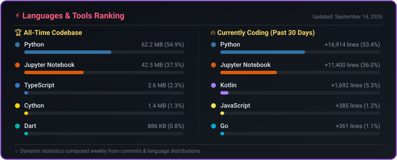
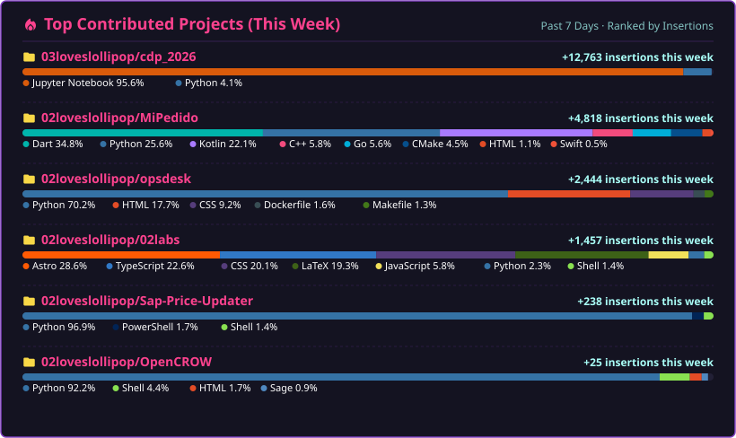
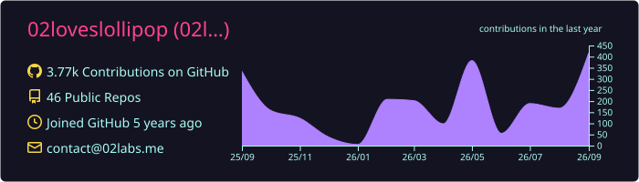

<!-- Intro  -->
<h3 align="center">
        <samp>&gt; Hey There!, I am
                <b><a target="_blank" href="https://02loveslollipop.uk">02loveslollipop</a></b>
        </samp>
</h3>

 # About me
 

 
  
 🎓 &emsp; Pursuing dual bachelor’s degrees in Systems & Computer Engineering and Data Science  
 ❤️ &emsp; Love writing code in Python, Go and C  
 📧 &emsp; Reach me anytime: contact@02labs.me  
 🌐 &emsp; My web page and blog: [02labs.me](https://02labs.me)  [blog.02labs.me](https://blog.02labs.me)  

 
 
 

## Use To Code

<!-- START_SECTION:use_to_code -->

  

<!--
Data for search engine crawlers and screen readers:
| Rank | All-Time Language | Codebase (KB) | Est. Lines | Codebase Share | Currently Coding | Recent Share |
| :--- | :--- | :--- | :--- | :--- | :--- | :--- |
| 1 | Python | 63,911 KB | 1.87M lines | 75.0% | Python (+17,905 lines) | 48.9% |
| 2 | Java | 10,539 KB | 240k lines | 12.4% | JavaScript (+14,182 lines) | 38.8% |
| 3 | TypeScript | 2,684 KB | 72.3k lines | 3.1% | Kotlin (+1,692 lines) | 4.6% |
| 4 | JavaScript | 1,693 KB | 45.6k lines | 2.0% | Jupyter Notebook (+1,241 lines) | 3.4% |
| 5 | Cython | 1,478 KB | 43.3k lines | 1.7% | SQL (+556 lines) | 1.5% |
| 6 | Dart | 886 KB | 25.2k lines | 1.0% | Go (+361 lines) | 1.0% |
| 7 | C++ | 862 KB | 23.2k lines | 1.0% | CSS (+300 lines) | 0.8% |
| 8 | Jupyter Notebook | 456 KB | 9.5k lines | 0.5% | Shell (+212 lines) | 0.6% |
| 9 | LaTeX | 451 KB | 13.2k lines | 0.5% | Dockerfile (+75 lines) | 0.2% |
| 10 | CSS | 354 KB | 11.3k lines | 0.4% | TypeScript (+24 lines) | 0.1% |
-->
<!-- END_SECTION:use_to_code -->

 

<!-- START_SECTION:weekly_repos -->

  

<!--
Top Contributed Projects Data:
| Rank | Repository | Insertions | Commits | Primary Languages |
| :--- | :--- | :--- | :--- | :--- |
| 1 | 02loveslollipop/flareform | +26,015 lines | 3 commits | JavaScript (100.0%) |
| 2 | 03loveslollipop/cdp_2026 | +25,071 lines | 30 commits | Python (81.0%), Jupyter Notebook (13.6%), HTML (3.7%), PowerShell (0.5%) |
| 3 | 02loveslollipop/MiPedido | +4,818 lines | 48 commits | Dart (34.8%), Python (25.6%), Kotlin (22.1%), C++ (5.8%), Go (5.6%), CMake (4.5%), HTML (1.1%), Swift (0.5%) |
| 4 | 02loveslollipop/OpenCROW | +4,519 lines | 41 commits | Python (92.2%), Shell (4.4%), HTML (1.7%), Sage (0.9%) |
| 5 | 02loveslollipop/opsdesk | +2,444 lines | 36 commits | Python (70.2%), HTML (17.7%), CSS (9.2%), Dockerfile (1.6%), Makefile (1.3%) |
| 6 | 02loveslollipop/02labs | +838 lines | 8 commits | Astro (28.6%), TypeScript (22.6%), CSS (20.1%), LaTeX (19.3%), JavaScript (5.8%), Python (2.3%), Shell (1.4%) |
| 7 | 02loveslollipop/Sap-Price-Updater | +238 lines | 5 commits | Python (96.9%), PowerShell (1.7%), Shell (1.4%) |
-->
<!-- END_SECTION:weekly_repos -->

 

### Frameworks, Tools & Platforms

               

 

 

 

  

  

 
  
  

